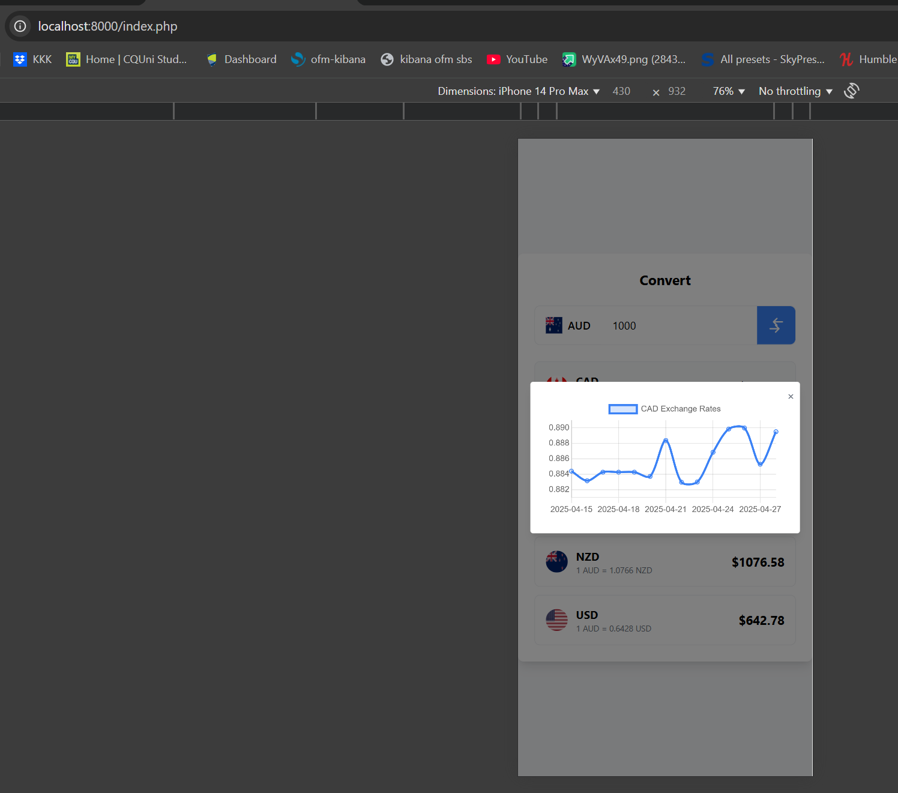

# Money Convert App

## Table of Contents

- [Overview](#overview)
- [Project Structure](#project-structure)
    - [Directory Structure](#directory-structure)
    - [Database Diagram](#database_diagram)
- [Getting Started](#getting-started)
    - [Clone the Repository](#clone-the-repository)
    - [Setting Up the Development Environment](#setting-up-the-development-environment)
- [Sample Screenshots](#sample-screenshots)


## Overview

The **Money Convert App** is an application used to show the foreign exchange rate from a currency (AUD by default) to other currency.


## Project Structure

The project is organized as a typical Laravel application, with the addition of a `docker` directory containing the Docker configurations and scripts.

### Directory Structure

```
project-root/ 
├── src/ # Laravel app folder
│   ├── app/ # Docker files used for php-fpm 
│   │   ├── Console 
│   │   │   ├── Commands # Command used to get and populate historical data
│   │   ├── Http 
│   │   │   ├── Controllers # Controllers to handle requests and responses
│   │   ├── Models # Model classes for entities
│   │   ├── Providers # Service Provider Class used for dependency injection
│   │   ├── Repositories # Repositories classes and interfaces to handle database interaction
│   │   ├── Services # Service classes to handle business logic and call external API
│   ├── ... # Other Laravel files and directories 
├── docker/ 
│   ├── nginx/ #  Docker files used for nginx
│   ├── php-fpm/ # Docker files used for php-fpm 
├── docker-compose.yml # Docker Compose file 
```
## Database Diagram

The application consist of 2 simple entities: 
- currencies which manage the base currency and the list of currency to be converted to.
- historical_exchange rates which store the historical data.


## Getting Started

Follow these steps to set up and run the Money Convert App:

### Prerequisites
Ensure you have Docker and Docker Compose installed. You can verify by running:

```bash
docker --version
docker compose version
```

If these commands do not return the versions, install Docker and Docker Compose using the official documentation: [Docker](https://docs.docker.com/get-docker/) and [Docker Compose](https://docs.docker.com/compose/install/).

### Clone the Repository

```bash
git clone https://github.com/hakuno1427/moneyConvert.git
cd moneyConvert
```

### Setting Up the Development Environment

1. Copy the .env.example file to .env and adjust any necessary environment variables:

```bash
cp ./src/.env.example ./src/.env
```

2. Start the Docker Compose Services:

```bash
docker compose up -d
```

3. Install Laravel Dependencies:

```bash
docker compose exec app composer install
docker compose exec app npm install
```

4. Generate Applicate key
```bash
docker compose exec app php artisan key:generate
```
4. Run Migrations:

```bash
docker compose exec app php artisan migrate --seed
```

5. Run Historical Sync Rate Command to get the historical conversion rate data into database:

```bash
docker compose exec app php artisan currency:sync-historical
```

6. Access the Application:

Open your browser and navigate to [http://localhost:8000](http://localhost:8000).

### Sample Screenshots

Here are some sample screenshots of the working application

On Web browser:


On Iphone device's dimension:



On Android device's dimension:


